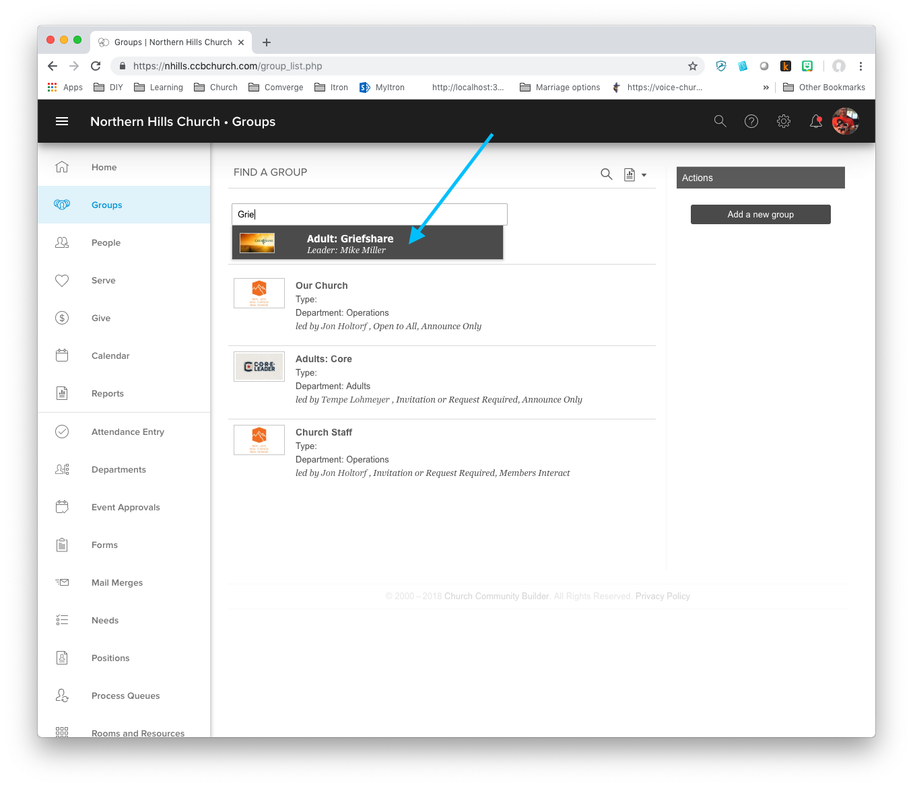
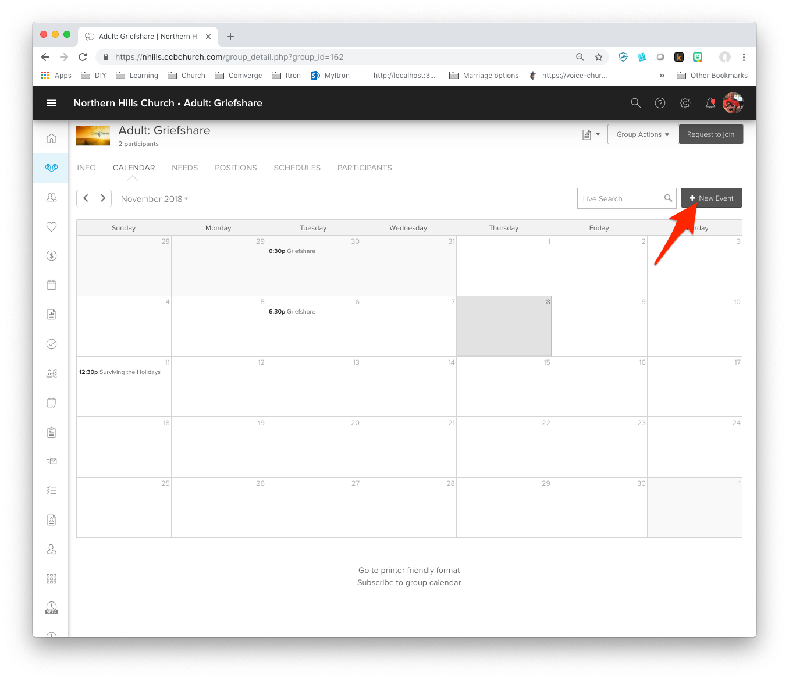
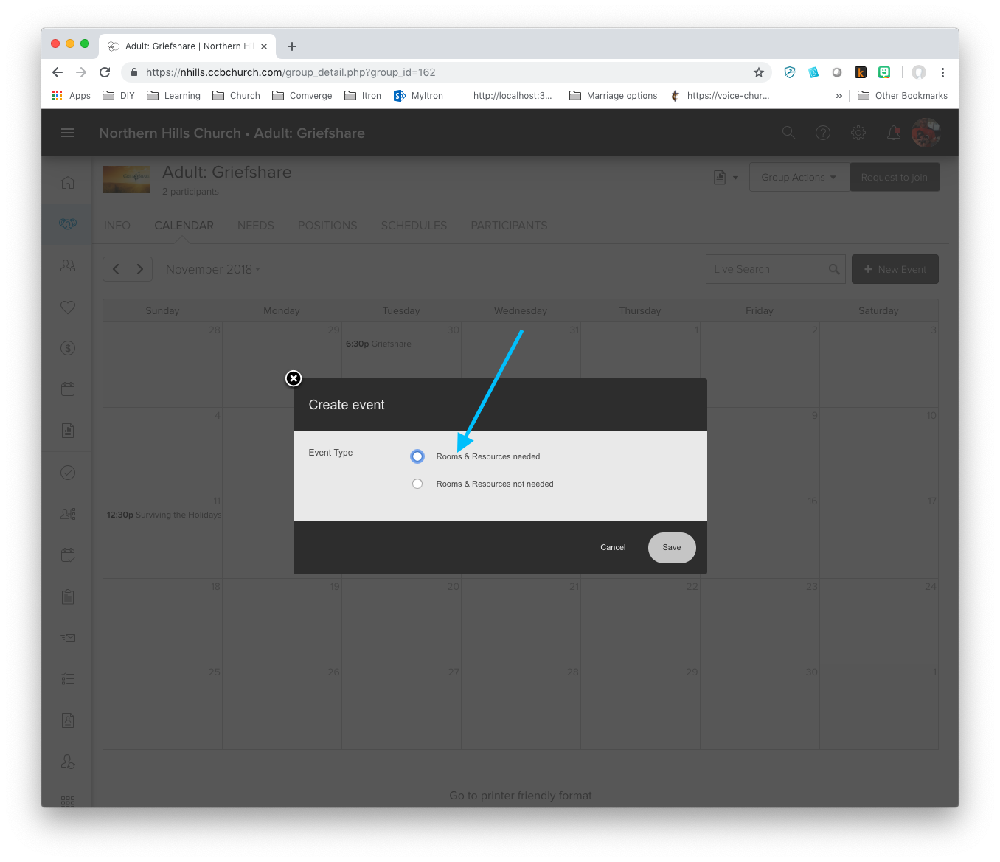
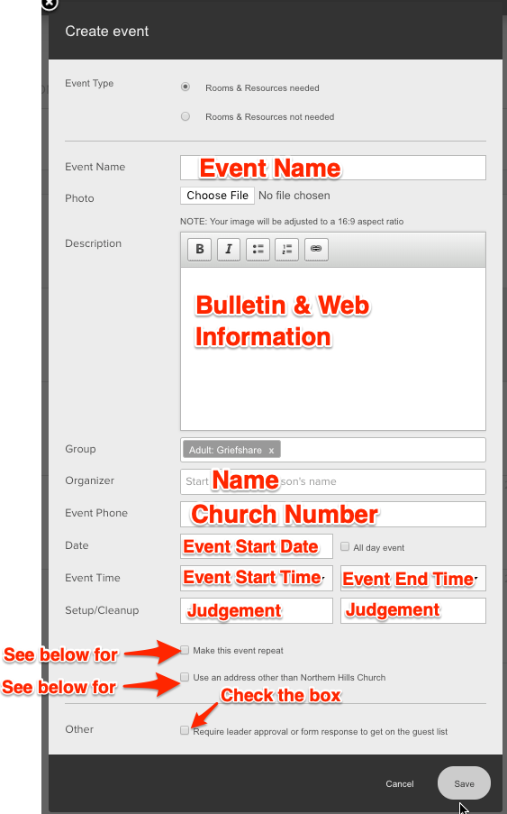
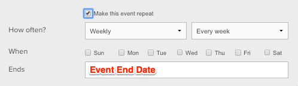

# Create Calendar Event 
1. Find Group name from request (Response key: `GROUP INFORMATION`)  
1. Click `Groups`  
1. In the search field type group name from step 1  
1. Select Group from dropdown  
  
1. Ensure the `Calendar` is selected  
1. Click `New Event`  
  
1. Select `Rooms & Resources needed`  
  
1. Click Save  
1. Fill in based upon response as shown below  
  
1. If Event is recurring fill in below  
  
1. Click Save  