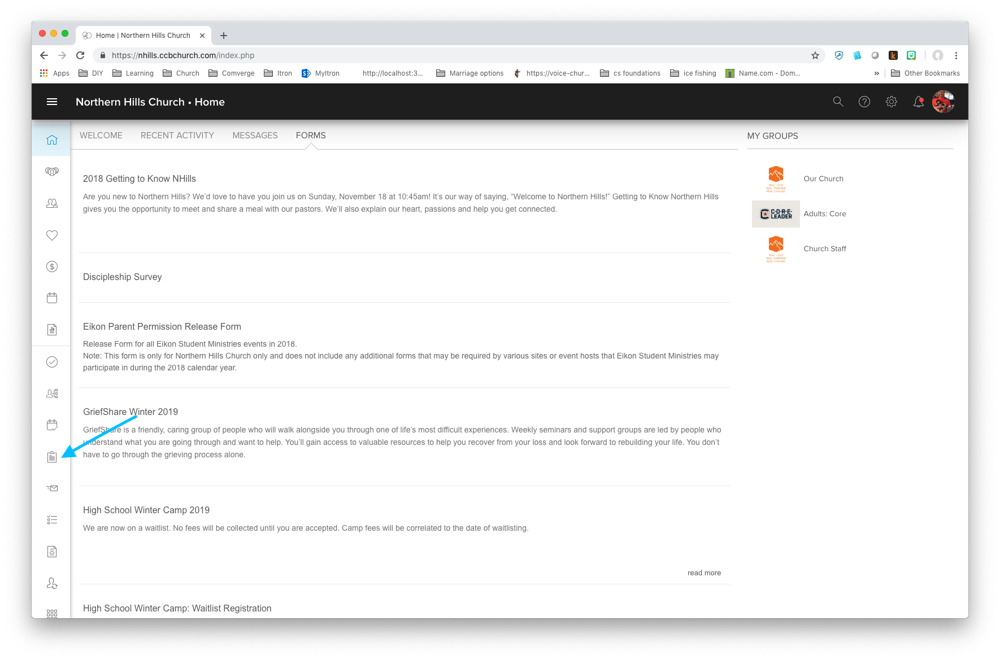
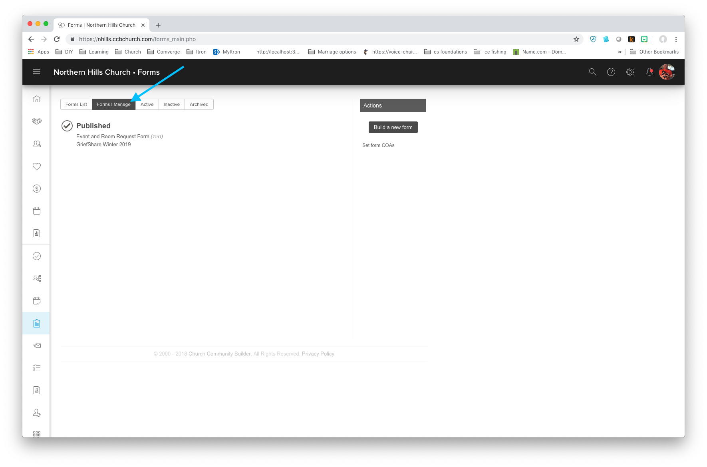
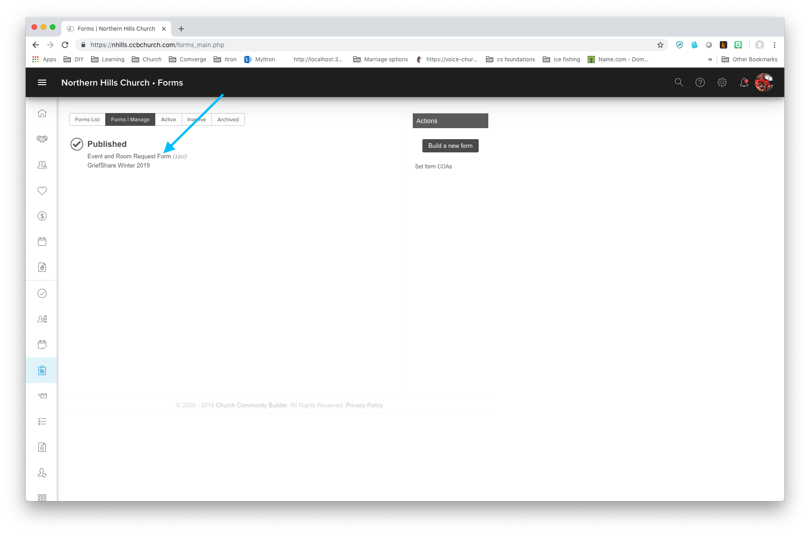
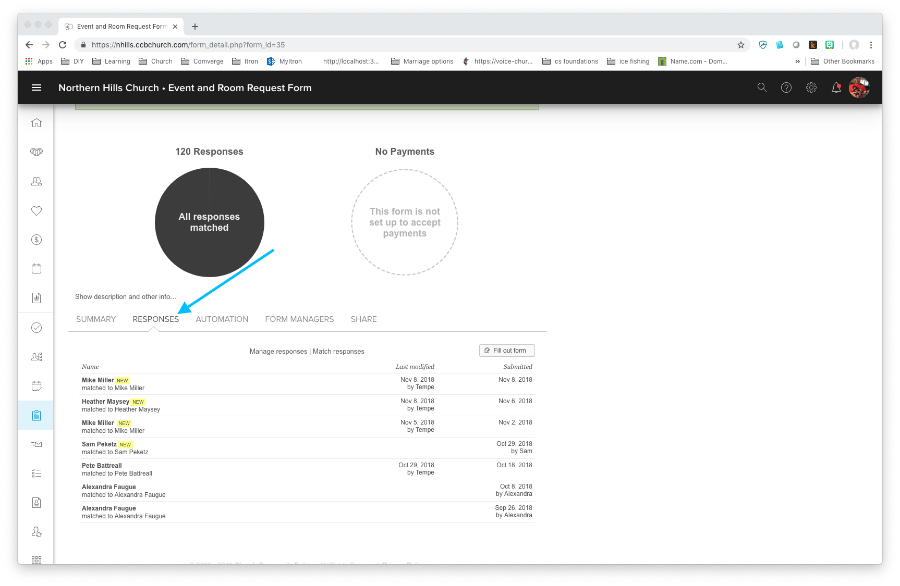
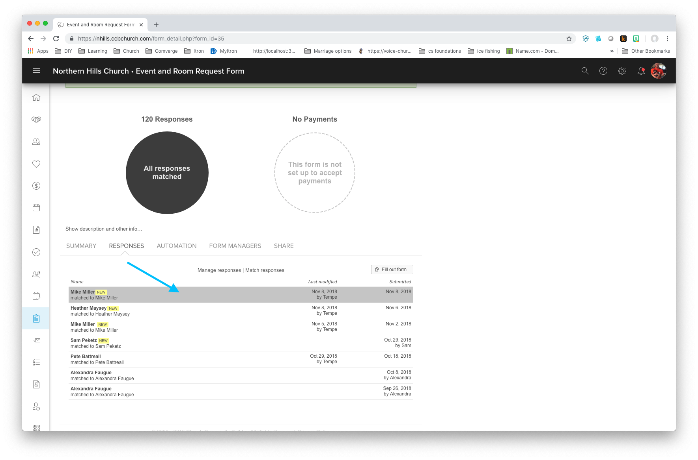

#  Create PDF from Requests
1. From Home   
1. Click `Forms`  
   
1. Click `Forms I Manage`
   
1. Click `Event and Room Request Form`
   
1. Click `Responses`
  
1. Select a response request
  
1. Click Print  
1. Save as PDF